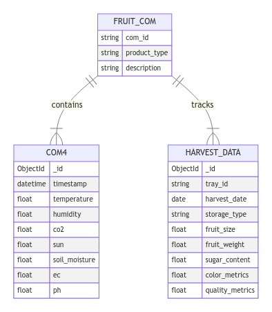

# Extracting data from Excel files and uploading to the database

## 1. Processing raw data 
 [Jupyter notebook](merge_dataset/smartfarm2_excel_analysis.ipynb) contains the code for:
- Extracting data from Sheets
- Structuring data into a DataFrame
- Saving them to new CSV files

## 2. Uploading data to the database
[Jupyter notebook](merge_dataset/upload_csv_to_database.ipynb) contains the code for:
- Connecting to the database using SSH tunneling
- Uploading CSV files to the database `Windows-DESKTOP-3HVBJEA` (SM2)
- Collection `HARVEST_DATA` stores the data from the harvesters:

| Field Name | Description | Data Type | Format/Units |
|------------|-------------|-----------|--------------|
| Date | Date of the record | Date | YYYY-MM-DD |
| Product Name | Name of the product | String | Examples: '죽향저장', '죽향실온', '메리퀸' |
| Section | Section identifier | String | - |
| Plant | Plant identifier | String | - |
| Fruit vertical length | Vertical length of the fruit | Float | Millimeters (mm) |
| Fruit horizontal length | Horizontal length of the fruit | Float | Millimeters (mm) |
| Fruit weight | Weight of the fruit | Float | Grams (g) |
| Hardness | Hardness measurement of the fruit | Float | Units specific to measurement device |
| Sweetness | Sweetness measurement of the fruit | Float | Brix (°Bx) |
| Acidity | Acidity measurement of the fruit | Float | pH or Titratable Acidity (%) |
| Color L | L* value in the L*a*b* color space | Float | 0 (black) to 100 (white) |
| Color a | a* value in the L*a*b* color space | Float | Negative (green) to positive (red) |
| Color b | b* value in the L*a*b* color space | Float | Negative (blue) to positive (yellow) |
| Remarks | Additional notes or comments | String | - |

### Note:
- "Section" and "Plant" fields are used to identify specific locations or individual plants.

## 3. Verifying the data
[Jupyter notebook](merge_dataset/verify_database.ipynb) contains the code for:  
- Read the csv data (exprting from the database) 
- Verify the data: AVG

## 4. Querying the data from the database
Check out [Jupyter notebook](merge_dataset/query_database.ipynb).
1. Harvest data is retrieved from the HARVEST_DATA collection.
2. Corresponding sensor data is fetched from either COM4 or COM5 collections based on the product.
3. Sensor data is aggregated (usually averaged) for each day.
4. The aggregated sensor data is combined with the harvest data.
5. The resulting dataset is sorted by Date, Product Name, Section, and Plant.
